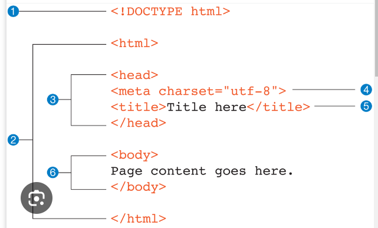

# Introduction to HTML
HTML stands for HyperText Markup Language. It is the standard markup language used to create web pages. HTML is a combination of Hypertext and Markup language. Hypertext defines the link between web pages. A markup language is used to define the text document within the tag to define the structure of web pages.

This language is used to annotate (make notes for the computer) text so that a machine can understand it and manipulate text accordingly. Most markup languages (e.g. HTML) are human-readable. The language uses tags to define what manipulation has to be done on the text.

## What is HTML?
HTML stands for HyperText Markup Language and it is used to create webpages. It uses HTML tags and attributes to describe the structure and formatting of a web page.
HTML consists of various elements, that are responsible for telling search engines how to display page content. For example, headings, lists, images, links, and more.

 ```<!DOCTYPE html>
<html>
<head>
	<title>First HTML Code</title>
</head>
<body>
	<h2>Welcome To Html</h2>
	<p>Hello world!</p>
</body>
</html>
```

## HTML Elements and Tags
HTML uses predefined tags and elements that tell the browser how to display the content. HTML elements include an opening tag, some content, and a closing tag.

## HTML Page Structure
The basic structure of an HTML page is shown below. It contains the essential building-block elements (i.e. doctype declaration, HTML, head, title, and body elements) upon which all web pages are created.



- `<!DOCTYPE html>` – This is the document type declaration (not technically a tag). It declares a document as being an HTML document. The doctype declaration is not case-sensitive.
- `<html>` – This is called the HTML root element. All other elements are contained within it.
- `<head>` – The head tag contains the “behind the scenes” elements for a webpage. Elements within the head aren’t visible on the front end of a webpage. HTML elements used inside the <head> element include: 
- `<style>` – This HTML tag allows us to insert styling into our web pages and make them appealing to look at with the help of CSS.
- `<title>` – The title is what is displayed on the top of your browser when you visit a website and contains the title of the webpage that you are viewing.
- `<base>` – It specifies the base URL for all relative URL’s in a document.
- `<noscript>` – Defines a section of HTML that is inserted when the scripting has been turned off in the user’s browser.
- `<script>` – This tag is used to add functionality to the website with the help of JavaScript.
- `<meta>` – This tag encloses the metadata of the website that must be loaded every time the website is visited. For eg:- the metadata charset allows you to use the standard UTF-8 encoding on your website. This in turn allows the users to view your webpage in the language of their choice. It is a self-closing tag.
- `<link>` – The ‘link’ tag is used to tie together HTML, CSS, and JavaScript. It is self-closing.
- `<body>` – The body tag is used to enclose all the visible content of a webpage. In other words, the body content is what the browser will show on the front end.

An HTML document can be created using an HTML text editor. Save the text file using the “.html” or “.htm” extension. Once saved as an HTML document, the file can be opened as a webpage in the browser.

## Features of HTML
- It is easy to learn and easy to use.
- It is platform-independent.
- Images, videos, and audio can be added to a web page.
- Hypertext can be added to the text.
- It is a markup language.

## Advantages of HTML
- HTML is used to build websites.
- It is supported by all browsers.
- It can be integrated with other languages like CSS, JavaScript, etc.

## Disadvantages of HTML
- HTML can only create static web pages. For dynamic web pages, other languages have to be used.
- A large amount of code has to be written to create a simple web page.
- The security feature is not good.